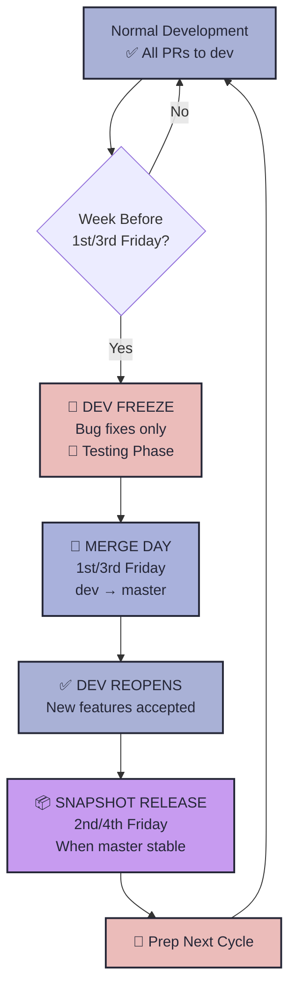
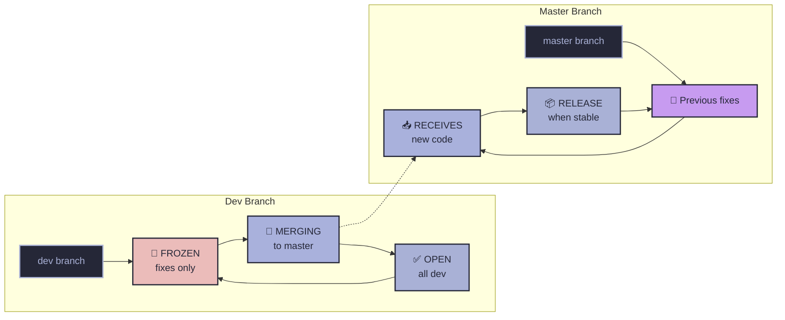

## Release & Branching Policy - Quarterly Releases

#### Three Key Points

1. **Development** - All development and PRs target`dev`
2. **Release** - Merge`dev` →`master` twice per month (1st Quarter & 3rd Quarter)
3. **Snapshot** - Create official releases from stable`master` branch---

---

## Quarterly Release Schedule Flow

- **1st Quarter (1st Friday):** Merge`dev` →`master` → Snapshot release (2nd Friday)
- **3rd Quarter (3rd Friday):** Merge`dev` →`master` → Snapshot release (4th Friday)

#### 1st Quarter Cycle

**Week before 1st Friday:**

- 🚫**Dev freeze** - No new PRs merged to`dev` (fixes only)
- 🧪**Testing phase** - Focus on validation and bug fixes

**1st Friday:**

- 🔄**Merge `dev` → `master`**
- ✅**Dev reopens** - New features and PRs accepted

**2nd Friday:**

- 📦**Snapshot release** (when`master` is stable)

#### 3rd Quarter Cycle

**Week before 3rd Friday:**

- 🚫**Dev freeze** - No new PRs merged to`dev` (fixes only)
- 🧪**Testing phase** - Focus on validation and bug fixes

**3rd Friday:**

- 🔄**Merge `dev` → `master`**
- ✅**Dev reopens** - New features and PRs accepted

**4th Friday:**

- 📦**Snapshot release** (when`master` is stable)
- 🔄**Preparation for next cycle/month**

#### Summary

| Quarter               | Freeze Week         | Merge Friday | Snapshot Friday | Dev Status |
| --------------------- | ------------------- | ------------ | --------------- | ---------- |
| **1st Quarter** | Week before 1st Fri | 1st Friday   | 2nd Friday      | 🚫→✅     |
| **3rd Quarter** | Week before 3rd Fri | 3rd Friday   | 4th Friday      | 🚫→✅     |

**Key Rules:**

- 🚫**Freeze weeks:** No new features to`dev` (fixes only)
- ✅**Open weeks:** All development welcomed
- 📦**Snapshots:** Only when`master` is stable
- 🔄**4th Friday:** Preparation for next cycle/month

---

## Weekly Summary

| Phase                                           | Dev Branch Status   | Allowed Changes                                                     | Description               |
| ----------------------------------------------- | ------------------- | ------------------------------------------------------------------- | ------------------------- |
| **Freeze Week** (before 1st & 3rd Friday) | 🚫**FROZEN**  | ❌ No new features ` `✅ Bug fixes ` `✅ Non-breaking QoL | Testing and validation    |
| **Merge Friday** (1st & 3rd of month)     | 🔄**MERGING** | 🔄 Merge to master                                                  | Deploy stable code        |
| **Stabilization Week** (after merge)      | ✅**OPEN**    | ✅ All development ` `🔧 Critical hotfixes                     | Monitor master & develop  |
| **Snapshot Release**                      | 📦**RELEASE** | 📦 Create release                                                   | When `master` is stable |

---

## Monthly Timeline

| Period                                   | Dev Status                | Master Status          | Activity                    | Focus                  |
| ---------------------------------------- | ------------------------- | ---------------------- | --------------------------- | ---------------------- |
| **Week before 1st Friday**         | 🚫**FROZEN**        | 🔧 Previous fixes      | Testing & validation        | 🧪 Prepare for merge   |
| **1st Friday**                     | 🔄**MERGING**       | 📥 Receives new code   | Merge `dev` → `master` | 🔄 Deploy              |
| **Week after 1st Friday**          | ✅**OPEN**          | 🔧 Hotfixes only       | Active development          | � New features to dev |
| **2nd Friday**                     | �**FREEZE begins** | �📦**SNAPSHOT** | Release when stable         | 📦 Release             |
| **Week before 2nd-to-last Friday** | 🚫**FROZEN**        | 🔧 Minor fixes only    | Testing & validation        | 🧪 Prepare for merge   |
| **2nd-to-last Friday**             | 🔄**MERGING**       | 📥 Receives new code   | Merge `dev` → `master` | 🔄 Deploy              |
| **Week after 2nd-to-last Friday**  | ✅**OPEN**          | 🔧 Hotfixes only       | Active development          | � New features to dev |
| **Last Friday**                    | �**FREEZE begins** | 📦**SNAPSHOT**   | Release when stable         | 📦 Release             |

**Freeze periods: ~2 weeks per month (handles variable month lengths)**

---

## Versioning

We use **year.month.quarter** format (`vYY.M.Q`) instead of traditional semantic versioning for several reasons:

- **Release-cycle aligned:** Matches our quarterly release schedule perfectly
- **Time-based clarity:** Instantly shows when a release was made
- **Predictable progression:** Always`.1` then`.3` each month
- **No arbitrary numbers:** No confusion about what constitutes "major" vs "minor"
- **User-friendly:** Easy to understand -`v25.7.1` = "July 2025, 1st Quarter"

---

## Pull Requests

- All pull requests should be made against`dev` branch
- Pull requests should be reviewed and approved by at least one other developer before merging
- Pull requests can be created anytime, but should be merged to`dev` branch before releasing on`master` branch
- Pull requests should not be merged directly into`master` branch
- Pull requests should be merged within the release window for`master` branch

---

# FLOWCHART 

Here are some visuals to help you understand the flowchart better.

## Development Flow

## Branch Flow

## Quarterly Release Schedule

```mermaid
gantt
    title Quarterly Release Schedule
    dateFormat  X
    axisFormat %d
    
    section Week 1
    🚫 Dev Freeze    :freeze1, 1, 7d
    🧪 Testing       :test1, 1, 7d
    
    section Week 2
    🔄 Merge Friday  :merge1, 8, 1d
    📦 Snapshot      :release1, 12, 1d
    ✅ Dev Open      :open1, 8, 7d
    
    section Week 3
    🚫 Dev Freeze    :freeze2, 15, 7d
    🧪 Testing       :test2, 15, 7d
    
    section Week 4
    🔄 Merge Friday  :merge2, 22, 1d
    📦 Snapshot      :release2, 26, 1d
    ✅ Dev Open      :open2, 22, 7d
```

