## Release & Branching Policy - Quarterly Releases

#### Three Key Points

1. **Development** - All development and PRs target`dev`
2. **Release Candidate** - On Freeze Week, merge`dev` →`rc` (release-candidate). Only bug fixes and stabilization allowed in`rc`. `dev` remains open for new features.
3. **Release** - Merge`rc` →`master` twice per month (1st Quarter & 3rd Quarter)
4. **Snapshot** - Create snapshot releases from stable`master` branch

> **Note:** The `dev` branch is always open for new features and development every week, regardless of the release cycle. Only the `rc` (release-candidate) branch is frozen for testing and bug fixes during release preparation.

---

## Quarterly Release Schedule Flow

- **Week before 1st/3rd Friday (Freeze Week):**
  - 🔄 Merge latest `dev` → `rc` (release-candidate)
  - 🚫 `rc` branch is frozen: Only bug fixes and stabilization allowed
  - ✅ `dev` branch remains open: New features and PRs accepted
- **1st/3rd Friday:**
  - 🔄 Merge `rc` → `master`
  - 📦 Snapshot release (when `master` is stable)
  - 🔄 Preparation for next cycle/month
  - ✅ `dev` branch remains open: New features and PRs accepted

#### 1st & 3rd Quarter Cycle

**Week before 1st/3rd Friday (Freeze Week):**

- 🔄 Merge `dev` → `rc`
- 🚫 **rc freeze** - Only bug fixes and stabilization in `rc`
- ✅ **dev open** - New features and PRs accepted

**1st/3rd Friday:**

- 🔄 Merge `rc` → `master`
- 📦 **Snapshot release** (when `master` is stable)
- 🔄 **Preparation for next cycle/month**

#### Summary

| Quarter               | Freeze Week         | Merge Friday | Snapshot Friday | Dev Status | RC Status |
| --------------------- | ------------------- | ------------ | --------------- | ---------- | --------- |
| **1st Quarter** | Week before 1st Fri | 1st Friday   | 2nd Friday      | ✅ OPEN     | 🚫 FROZEN |
| **3rd Quarter** | Week before 3rd Fri | 3rd Friday   | 4th Friday      | ✅ OPEN     | 🚫 FROZEN |

**Key Rules:**

- 🚫**Freeze weeks:** Merge `dev` → `rc`. Only bug fixes to `rc`. `dev` remains open for new features.
- ✅**Open weeks:** All development welcomed in `dev`
- 📦**Snapshots:** Only when`master` is stable
- 🔄**4th Friday:** Preparation for next cycle/month

---

## Weekly Summary

| Phase                                           | Dev Branch Status   | RC Branch Status   | Allowed Changes                                                     | Description               |
| ----------------------------------------------- | ------------------- | ------------------ | ------------------------------------------------------------------- | ------------------------- |
| **Freeze Week** (before 1st & 3rd Friday) | ✅**OPEN**      | 🚫**FROZEN**     | ⌠No new features in `rc` ✅ Bug fixes in `rc` ✅ All dev in `dev` | Testing and validation    |
| **Merge Friday** (1st & 3rd of month)     | ✅**OPEN**      | 🔄**MERGING**    | 🔄 Merge `rc` to master                                              | Deploy stable code        |
| **Stabilization Week** (after merge)      | ✅**OPEN**      | ✅**OPEN**       | ✅ All development in `dev` 🔧 Critical hotfixes in `rc`           | Monitor master & develop  |
| **Snapshot Release**                      | ✅**OPEN**      | 📦**RELEASE**    | 📦 Create release                                                   | When `master` is stable   |

---

## Monthly Timeline

| Period                                   | Dev Status                | RC Status             | Master Status          | Activity                    | Focus                  |
| ---------------------------------------- | ------------------------- | --------------------- | ---------------------- | --------------------------- | ---------------------- |
| **Week before 1st Friday**         | ✅**OPEN**          | 🚫**FROZEN**        | 🔧 Previous fixes      | Testing & validation        | 🧪 Prepare for merge   |
| **1st Friday**                     | ✅**OPEN**          | 🔄**MERGING**        | 📥 Receives new code   | Merge `rc` → `master` | 🔄 Deploy              |
| **Week after 1st Friday**          | ✅**OPEN**          | ✅**OPEN**           | 🔧 Hotfixes only       | Active development          | 🚀 New features to dev |
| **2nd Friday**                     | ✅**OPEN**          | ✅**OPEN**           | 📦**SNAPSHOT**         | Release when stable         | 📦 Release             |
| **Week before 2nd-to-last Friday** | ✅**OPEN**          | 🚫**FROZEN**        | 🔧 Minor fixes only    | Testing & validation        | 🧪 Prepare for merge   |
| **2nd-to-last Friday**             | ✅**OPEN**          | 🔄**MERGING**        | 📥 Receives new code   | Merge `rc` → `master` | 🔄 Deploy              |
| **Week after 2nd-to-last Friday**  | ✅**OPEN**          | ✅**OPEN**           | 🔧 Hotfixes only       | Active development          | 🚀 New features to dev |
| **Last Friday**                    | ✅**OPEN**          | ✅**OPEN**           | 📦**SNAPSHOT**         | Release when stable         | 📦 Release             |

**Freeze periods: ~2 weeks per month (handles variable month lengths)**

---

## Versioning YY.M.Q

We use **year.month.quarter** format (`YY.M.Q`) instead of traditional semantic versioning for several reasons:

- **Release-cycle aligned:** Matches our quarterly release schedule perfectly
- **Time-based clarity:** Instantly shows when a release was made
- **Predictable progression:** Always `.1` then `.3` each month
- **No arbitrary numbers:** No confusion about what constitutes "major" vs "minor"
- **User-friendly:** Easy to understand - `25.7.1` = "July 2025, 1st Quarter"

---

## Pull Requests

- All pull requests should be made against`dev` branch
- Pull requests should be reviewed and approved by at least one other developer before merging
- Pull requests can be created anytime, but should be merged to`dev` branch before releasing on`master` branch
- Pull requests should not be merged directly into`master` branch
- Pull requests should be merged within the release window for`master` branch

---

# FLOWCHART 

Here are some visuals to help you understand the flowchart better.

## Development Flow

```mermaid
graph TD
    A[Normal Development<br/>✅ All PRs to dev] --> B{Week Before<br/>1st/3rd Friday?}
    B -->|Yes| C[🔄 DEV → RC<br/>rc frozen<br/>🧪 Testing Phase]
    B -->|No| A
    
    C --> D[🔄 MERGE DAY<br/>1st/3rd Friday<br/>rc → master]
    D --> E[✅ DEV & RC REOPEN<br/>New features to dev]
    E --> F[📦 SNAPSHOT RELEASE<br/>2nd/4th Friday<br/>When master stable]
    F --> G[🔄 Prep Next Cycle]
    G --> A
    
    style A fill:#a9b1d6,stroke:#252737,stroke-width:2px,color:#252737
    style C fill:#ebbcba,stroke:#252737,stroke-width:2px,color:#252737
    style D fill:#a9b1dc,stroke:#252737,stroke-width:2px,color:#252737
    style E fill:#a9b1d6,stroke:#252737,stroke-width:2px,color:#252737
    style F fill:#c79bf0,stroke:#252737,stroke-width:2px,color:#252737
    style G fill:#ebbcba,stroke:#252737,stroke-width:2px,color:#252737
```

## Branch Flow

```mermaid
graph LR
    subgraph "Dev Branch"
        DEV[dev branch] --> RC[🔄 MERGE<br/>to rc]
        RC --> FROZEN[🚫 rc FROZEN<br/>fixes only]
        FROZEN --> MERGE[🔄 MERGING<br/>rc to master]
        MERGE --> OPEN[✅ OPEN<br/>all dev]
        OPEN --> RC
    end
    
    subgraph "RC Branch"
        RC2[rc branch] --> FROZEN2[🚫 FROZEN<br/>fixes only]
        FROZEN2 --> MERGE2[🔄 MERGING<br/>to master]
        MERGE2 --> OPEN2[✅ OPEN<br/>accepts new dev]
        OPEN2 --> RC2
    end
    
    subgraph "Master Branch"
        MASTER[master branch] --> PREV[🔧 Previous fixes]
        PREV --> RECEIVE[📥 RECEIVES<br/>new code]
        RECEIVE --> RELEASE[📦 RELEASE<br/>when stable]
        RELEASE --> PREV
    end
    
    MERGE -.-> RECEIVE
    MERGE2 -.-> RECEIVE
    
    style DEV fill:#252737,stroke:#a9b1d6,stroke-width:2px,color:#a9b1d6
    style RC fill:#a9b1dc,stroke:#252737,stroke-width:2px,color:#252737
    style FROZEN fill:#ebbcba,stroke:#252737,stroke-width:2px,color:#252737
    style MERGE fill:#a9b1dc,stroke:#252737,stroke-width:2px,color:#252737
    style OPEN fill:#a9b1d6,stroke:#252737,stroke-width:2px,color:#252737
    style RC2 fill:#a9b1dc,stroke:#252737,stroke-width:2px,color:#252737
    style FROZEN2 fill:#ebbcba,stroke:#252737,stroke-width:2px,color:#252737
    style MERGE2 fill:#a9b1dc,stroke:#252737,stroke-width:2px,color:#252737
    style OPEN2 fill:#a9b1d6,stroke:#252737,stroke-width:2px,color:#252737
    style MASTER fill:#252737,stroke:#a9b1d6,stroke-width:2px,color:#a9b1d6
    style PREV fill:#c79bf0,stroke:#252737,stroke-width:2px,color:#252737
    style RECEIVE fill:#a9b1dc,stroke:#252737,stroke-width:2px,color:#252737
    style RELEASE fill:#a9b1d6,stroke:#252737,stroke-width:2px,color:#252737
```

## Quarterly Release Schedule

```mermaid
gantt
    title Monthly Release Schedule
    dateFormat  X
    axisFormat %a %d

    section Week 1
    ✅ Dev Open                :devopen1, 1, 7d
    🔄 Dev → RC                :devrc1, 2, 1d
    🚫 RC Freeze & Testing     :rctest1, 3, 5d

    section Week 2
    ✅ Dev Open                :devopen2, 8, 7d
    🔄 RC → Master (Friday)    :rcmaster1, 9, 1d
    🧪 Master Testing          :mastertest1, 10, 3d
    📦 Snapshot (Friday)       :release1, 14, 1d

    section Week 3
    ✅ Dev Open                :devopen3, 15, 7d
    🔄 Dev → RC                :devrc2, 16, 1d
    🚫 RC Freeze & Testing     :rctest2, 17, 5d

    section Week 4
    ✅ Dev Open                :devopen4, 22, 7d
    🔄 RC → Master (Friday)    :rcmaster2, 23, 1d
    🧪 Master Testing          :mastertest2, 24, 3d
    📦 Snapshot (Friday)       :release2, 1, 1d
```

