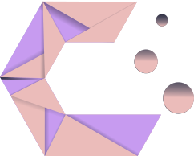
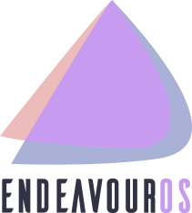
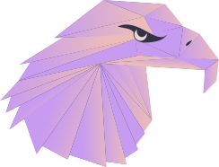
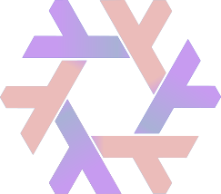

<div align = center>
  <a href="https://discord.gg/AYbJ9MJez7">
    
  </a>
</div>

###### _<div align="right"><a id=-design-by-t2></a><sub>// design by t2</sub></div>_


<!--
Multi-language README support
-->

[](../../README.md)
[](README.es.md)
[](README.de.md)
[](README.zh.md)
[](README.fr.md)
[](README.ar.md)
[](README.pt-br.md)

<div align="center"><br>
  <a href="#installatie"><kbd> <br> Installatie <br> </kbd></a>&ensp;&ensp;
  <a href="#updaten"><kbd> <br> Updaten <br> </kbd></a>&ensp;&ensp;
  <a href="#thema's"><kbd> <br> Thema's <br> </kbd></a>&ensp;&ensp;
  <a href="#stijlen"><kbd> <br> Stijlen <br> </kbd></a>&ensp;&ensp;
  <a href="KEYBINDINGS.nl.md"><kbd> <br> Toetscombinaties <br> </kbd></a>&ensp;&ensp;
  <a href="https://www.youtube.com/watch?v=2rWqdKU1vu8&list=PLt8rU_ebLsc5yEHUVsAQTqokIBMtx3RFY&index=1"><kbd> <br> Youtube <br> </kbd></a>&ensp;&ensp;
  <a href="https://hydeproject.pages.dev/"><kbd> <br> Wiki <br> </kbd></a>&ensp;&ensp;
  <a href="https://discord.gg/qWehcFJxPa"><kbd> <br> Discord <br> </kbd></a>
</div><br><br>

<div align="center">
  <div style="display: flex; flex-wrap: nowrap; justify-content: center;">
    
    
    
    
    
  </div>
</div>

Bekijk de volledige notitie hier:
[Reis naar HyDe en verder](../../Hyprdots-to-HyDE.md)

<https://github.com/prasanthrangan/hyprdots/assets/106020512/7f8fadc8-e293-4482-a851-e9c6464f5265>

<br>

<a id="installatie"></a>


---

Het installatiescript is ontworpen voor een minimale [Arch Linux](https://wiki.archlinux.org/title/Arch_Linux) installatie, maar het **kan** ook werken op sommige [Arch-gebaseerde distributies](https://wiki.archlinux.org/title/Arch-based_distributions).
Hoewel het installeren van HyDE naast een andere [DE](https://wiki.archlinux.org/title/Desktop_environment)/[WM](https://wiki.archlinux.org/title/Window_manager) zou moeten werken. Gaat het, vanwege de sterk aangepaste setup, **conflicteren** met je [GTK](https://wiki.archlinux.org/title/GTK)/[Qt](https://wiki.archlinux.org/title/Qt) thema's, [Shell](https://wiki.archlinux.org/title/Command-line_shell), [SDDM](https://wiki.archlinux.org/title/SDDM), [GRUB](https://wiki.archlinux.org/title/GRUB), enz. Dit is volledig het op eigen risico.

Voor NixOS-ondersteuning is er een apart project dat wordt onderhouden op [Hydenix](https://github.com/richen604/hydenix/tree/main)

> [!IMPORTANT]
> Het installatiescript detecteert automatisch een NVIDIA-kaart en installeert nvidia-dkms drivers voor je kernel.
> Zorg controleer dat je NVIDIA-kaart dkms drivers ondersteunt in [deze lijst](https://wiki.archlinux.org/title/NVIDIA).

> [!CAUTION]
> Dit script past je `grub` of `systemd-boot` instellingen aan om NVIDIA DRM te activeren.

Om te installeren, voer de volgende commando's uit:

```shell
pacman -S --needed git base-devel
git clone --depth 1 https://github.com/HyDE-Project/HyDE ~/HyDE
cd ~/HyDE/Scripts
./install.sh
```

> [!TIP]
> Je kan ook andere apps die je tegelijk met HyDe wenst te installeren toevoegen aan `Scripts/pkg_user.lst`. Deze file kan je dan als parameter aan de install meegeven:
>
> ```shell
> ./install.sh pkg_user.lst
> ```

> [!IMPORTANT]
> Baseer je lijst op basis van `Scripts/pkg_extra.lst`
> of je kunt `cp  Scripts/pkg_extra.lst Scripts/pkg_user.lst` Als je alle extra pakketten wilt installeren.

Start je systeem opnieuw op na het installatiescript klaar is en je voor de eerste keer naar het SDDM inlogscherm (of zwart scherm) brengt. Voor meer details, raadpleeg de [installatie wiki](https://github.com/HyDE-Project/HyDE/wiki/installation).

<div align="right">
  <br>
  <a href="#-design-by-t2"><kbd> <br> 🡅 <br> </kbd></a>
</div>

<a id="updaten"></a>


---

Om de HyDE te updaten, moet je de laatste aanpassingen van Github ophalen en de configuraties herstellen door de volgende commando's uit te voeren:

```shell
cd ~/HyDE/Scripts
git pull origin master
./install.sh -r
```

> [!IMPORTANT]
> Wees ervan bewust dat alle configuraties die je hebt gemaakt, worden overschreven als dit is aangegeven in `Scripts/restore_cfg.psv`.
> Alle vervangen configuraties worden wel geback-upt en kunnen worden hersteld vanuit `~/.config/cfg_backups`.

<div align="right">
  <br>
  <a href="#-design-by-t2"><kbd> <br> 🡅 <br> </kbd></a>
</div>

<a id="thema's"></a>


---

Al onze officiële thema's worden opgeslagen in een apart repository, waardoor gebruikers ze kunnen installeren met themepatcher.
Voor meer informatie, bezoek [HyDE-Project/hyde-themes](https://github.com/HyDE-Project/hyde-themes).

<div align="center">
  <table><tr><td>

[](https://github.com/HyDE-Project/hyde-themes/tree/Catppuccin-Latte)
[](https://github.com/HyDE-Project/hyde-themes/tree/Catppuccin-Mocha)
[](https://github.com/HyDE-Project/hyde-themes/tree/Decay-Green)
[](https://github.com/HyDE-Project/hyde-themes/tree/Edge-Runner)
[](https://github.com/HyDE-Project/hyde-themes/tree/Frosted-Glass)
[](https://github.com/HyDE-Project/hyde-themes/tree/Graphite-Mono)
[](https://github.com/HyDE-Project/hyde-themes/tree/Gruvbox-Retro)
[](https://github.com/HyDE-Project/hyde-themes/tree/Material-Sakura)
[](https://github.com/HyDE-Project/hyde-themes/tree/Nordic-Blue)
[](https://github.com/HyDE-Project/hyde-themes/tree/Rose-Pine)
[](https://github.com/HyDE-Project/hyde-themes/tree/Synth-Wave)
[](https://github.com/HyDE-Project/hyde-themes/tree/Tokyo-Night)

  </td></tr></table>
</div>

> [!TIP]
> Iedereen, inclusief jij, kan extra thema's maken, onderhouden en delen, die allemaal kunnen worden geïnstalleerd met themepatcher!
> Om je eigen aangepaste thema te maken, raadpleeg de [thema wiki](https://github.com/prasanthrangan/hyprdots/wiki/Theming).
> Als je wilt dat jouw HyDE-thema wordt getoond, of als je enkele niet-officiële thema's wilt vinden, bezoek [kRHYME7/hyde-gallery](https://github.com/kRHYME7/hyde-gallery)!

<div align="right">
  <br>
  <a href="#-design-by-t2"><kbd> <br> 🡅 <br> </kbd></a>
</div>

<a id="stijlen"></a>


---

<div align="center"><table><tr>Thema Selectie</tr><tr><td>
</td><td>
</td></tr></table></div>

<div align="center"><table><tr><td>Achtergrond Selectie</td><td>Starter Selectie</td></tr><tr><td>
</td><td>
</td></tr>
<tr><td>Wallbash Modes</td><td>Notificatie Actie</td></tr><tr><td>
</td><td>
</td></tr>
</table></div>

<div align="center"><table><tr>Rofi Starter</tr><tr><td>
</td><td>
</td><td>
</td></tr><tr><td>
</td><td>
</td><td>
</td></tr><tr><td>
</td><td>
</td><td>
</td></tr><tr><td>
</td><td>
</td><td>
</td></tr>
</table></div>

<div align="center"><table><tr>Wlogout Menu</tr><tr><td>
</td><td>
</td></tr></table></div>

<div align="center"><table><tr>Game Starter</tr><tr><td>
</td><td>
</td><td>
</td></tr></table></div>
<div align="center"><table><tr><td>
</td><td>
</td></tr></table></div>

<div align="right">
  <br>
  <a href="#-design-by-t2"><kbd> <br> 🡅 <br> </kbd></a>
</div>

<div align="right">
  <sub>Laatst bewerkt op: 21/03/2025<span id="last-edited"></span></sub>
</div>

<a id="star_history"></a>


---

<a href="https://star-history.com/#hyde-project/hyde&hyde-project/hyde-gallery&hyde-project/hyde-themes&Timeline">
 <picture>
   <source media="(prefers-color-scheme: dark)" srcset="https://api.star-history.com/svg?repos=hyde-project/hyde&type=Timeline&theme=dark" />
   <source media="(prefers-color-scheme: light)" srcset="https://api.star-history.com/svg?repos=hyde-project/hyde&type=Timeline" />
   
 </picture>
</a>
